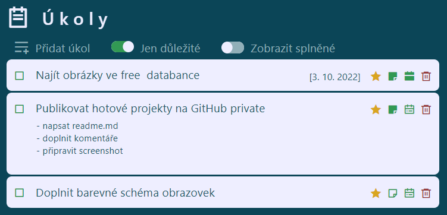

# Ukoly

**Úkoly** jsou jednoduchá aplikace pro správu úkolů, která slouží k výuce Vuejs, Typescriptu a GraphQL

## Popis

Aplikace obsahuje serverovou a klientskou část.

Server je NodeJS aplikace, která publikuje data přes GraphQL API. K uložení dat na serveru není použita databáze ale data jsou uložena v JSON souboru.

Klient pro zobrazení data ze serveru používá VueJS s Typescriptem.

Aplikace umožňuje vkládat, mazat a editovat jednotlivé úkoly. Každý úkol obsahuje:

- popis úkolu
- poznámku
- datum
- důležitost (ano/ ne)
- dokončeno (ano/ ne)

Seznam úkolů lze filtrovat jen dokončené nebo všechny a důležité nebo všechny.

## Použité technologie

### Server

[NodeJS](https://nodejs.org/), [GraphQL](https://graphql.org/), [Express](https://expressjs.com/)

### Klient

[Vue.js framework](https://vuejs.org/), [Typescript](https://www.typescriptlang.org/), [Axios](https://axios-http.com/)

## Licence

Distributed under the MIT License. See license.txt for more information.

## Contact

Autor: Standa Procházka - prochst.dev@gmmail.com

Projekt: [GitHub](https://github.com/prochst/Ukoly)
